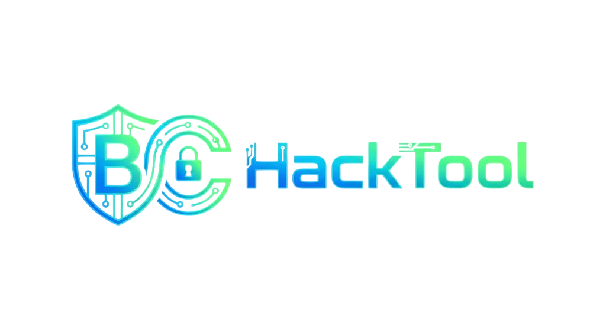
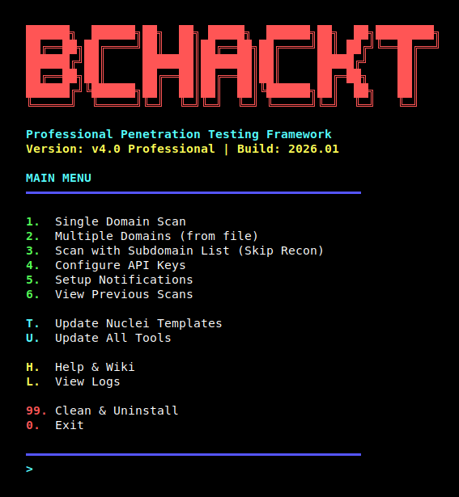

<div align="center">



<br><br>

**Professional Penetration Testing Framework v4.0**

[](https://github.com/ByCh4n/BCHackTool)
[](LICENSE)
[](https://www.gnu.org/software/bash/)
[](https://www.linux.org/)

</div>

---

## 📋 Table of Contents

- [Overview](#-overview)
- [What's New in v4.0](#-whats-new-in-v40)
- [Features](#-features)
- [Installation](#-installation)
- [Usage](#-usage)
- [Scan Modes](#-scan-modes)
- [Pipeline Architecture](#-pipeline-architecture)
- [Configuration](#-configuration)
- [Tools Integrated](#-tools-integrated)
- [Output & Reports](#-output--reports)
- [API Integration](#-api-integration)
- [Notifications](#-notifications)
- [Troubleshooting](#-troubleshooting)
- [Contributing](#-contributing)
- [License](#-license)

---

## 🎯 Overview

**BCHackTool** is a comprehensive, professional-grade penetration testing framework designed for security researchers, bug bounty hunters, and penetration testers. Built with bash, it orchestrates multiple industry-standard security tools into a streamlined, automated workflow.

### Key Highlights

- 🎨 **Modern UI/UX** - Emoji-rich interface with real-time vulnerability display
- 🚀 **Parallel Scanning** - 10x faster with concurrent tool execution
- 🎯 **Smart Targeting** - Intelligent subdomain enumeration and service discovery
- 🔍 **Deep Vulnerability Scanning** - Live detailed findings with Nuclei (9000+ templates)
- 📊 **Professional Reports** - Clean TXT reports with human-readable vulnerability findings
- ⚡ **Resume Capability** - Continue interrupted scans automatically
- 🔔 **Notifications** - Real-time alerts via Telegram/Discord/Slack
- 🛠️ **Modular Architecture** - Easy to extend and customize

---

## 🆕 What's New in v4.0

### Major Features

#### 1. **Modern UI/UX Design** 🎨
Emoji-rich interface with real-time vulnerability display and clean visual hierarchy!

**Features:**
- 🎯 **Emoji Navigation** - Intuitive menu system with visual indicators
- 📊 **Real-time Vulnerability Display** - Live detailed findings as Nuclei discovers them
- 🎨 **Color-coded Severity** - Instant visual feedback (🔴 Critical, 🟠 High, 🟡 Medium, 🟢 Low, ℹ️  Info)
- ✨ **Clean Spacing Design** - No box-drawing characters for universal terminal compatibility
- 📋 **Clean TXT Reports** - Human-readable vulnerability reports in current directory
- 📁 **Current Directory Output** - All results saved in BCHackTool_Results/ folder

**Live Vulnerability Display:**
```
[▶] Starting vulnerability scan...

🔴 [CRITICAL] CVE-2024-1234-RCE
   └─ Target: https://demo.xooi.com/api

🟠 [HIGH] SQL Injection Found
   └─ Target: https://our.xooi.com/login

🟡 [MEDIUM] XSS Vulnerability Detected
   └─ Target: https://app.xooi.com/search

🟢 [LOW] Information Disclosure
   └─ Target: https://api.xooi.com/debug

ℹ️  [INFO] Missing Security Headers
   └─ Target: https://www.xooi.com
```

#### 2. **Subdomain List Input Mode (Option 3)** 🎯
Skip the reconnaissance phase entirely and jump straight to vulnerability scanning!

```bash
# Use pre-collected subdomains
sudo bash bchacktool.sh
> 3  # Subdomain List option
Enter subdomain list file path: /path/to/subdomains.txt
Mode> ALL
```

**Benefits:**
- ⏱️ Save 30-50% scan time
- 🔄 Integrate with external recon tools
- 🎯 Test specific subdomains only
- 📝 Use results from previous scans

**File Format:**
```
example.com
www.example.com
api.example.com
mail.example.com
```

#### 3. **Full Nuclei Severity Scanning** 🔍
Now scans **ALL** severity levels instead of just medium+

**Before v4.0:**
- ❌ Info level: Filtered
- ❌ Low level: Filtered
- ✅ Medium: Included
- ✅ High: Included
- ✅ Critical: Included

**v4.0:**
- ✅ Info: Version disclosure, tech stack detection
- ✅ Low: Weak headers, minor misconfigurations
- ✅ Medium: CSRF, open redirects
- ✅ High: SQL injection, XSS
- ✅ Critical: RCE, authentication bypass

**Impact:**
- 📈 3-5x more findings
- 🎯 Complete security picture
- 📊 Better compliance reporting

#### 3. **Real-time Vulnerability Display** 📊
Live detailed findings as vulnerabilities are discovered

```
[▶] Starting vulnerability scan...

🔴 [CRITICAL] CVE-2024-1234-RCE
   └─ Target: https://api.example.com/admin

🟠 [HIGH] SQL Injection - Authentication Bypass
   └─ Target: https://login.example.com

🟡 [MEDIUM] Cross-Site Scripting (XSS)
   └─ Target: https://search.example.com?q=test
```

**Features:**
- Instant vulnerability notifications as they're found
- Detailed template identification
- Exact target URLs for each finding
- Color-coded severity for quick assessment
- No waiting for scan completion to see results

### Improvements from v3.1

- ✅ Parallel scanning with up to 10 concurrent jobs
- ✅ Checkpoint system for resume capability
- ✅ Enhanced error handling and retry logic
- ✅ JSON structured output for all tools
- ✅ Clean TXT reports with parsed vulnerability data
- ✅ API key integration (Shodan, VirusTotal, etc.)
- ✅ Multi-platform notification support
- ✅ Detailed logging system

---

## ✨ Features

### 🔍 Reconnaissance
- **7 Parallel Subdomain Enumeration Tools**
  - Subfinder (Passive OSINT)
  - Assetfinder (Web scraping)
  - Findomain (Multi-source API)
  - Wayback Machine (Archive.org)
  - GAU (GetAllUrls)
  - Crt.sh (Certificate logs)
  - Anubis (Passive DNS)

### 🔓 Port Scanning
- Fast SYN scanning with Naabu
- Top 1000 ports by default
- CDN exclusion for accurate results
- Rate limiting (300 req/sec - stealth mode)

### 🌐 Web Probing
- HTTP/HTTPS service detection
- Technology stack identification
- Status code validation
- Title extraction
- Redirect following

### 🎯 Vulnerability Scanning
- Template-based detection with Nuclei v3.6+
- 9000+ vulnerability templates (updated automatically)
- CVE database integration
- Custom template support
- All severity levels (info to critical)
- Real-time detailed vulnerability display
- Live findings as they're discovered

### 📊 Reporting
- Clean TXT reports with:
  - Vulnerability breakdown by severity
  - Subdomain discovery results
  - Live service inventory
  - Human-readable format
- JSON output for automation
- JSONL format for streaming
- All results saved in current directory (BCHackTool_Results/)

### 🔔 Notifications
- Telegram bot integration
- Discord webhook support
- Slack webhook support
- Scan completion alerts
- Error notifications

### ⚡ Performance
- Parallel tool execution (10 concurrent jobs)
- Optimized vulnerability counting (80% faster)
- Timeout management
- Resource optimization
- Stealth mode rate limiting (300 req/sec)
- Clean, efficient output (no overhead)

### 🛠️ Advanced Features
- Resume interrupted scans
- Checkpoint system
- API key management
- Automatic tool updates
- Template auto-updates
- Comprehensive logging

---

## 📦 Installation

### Prerequisites

- **Operating System**: Linux (Ubuntu 20.04+, Debian 10+, Kali Linux)
- **Root Access**: Required for some tools
- **Internet Connection**: For tool installation and updates

### Quick Install

```bash
# Download
git clone https://github.com/ByCh4n/BCHackTool.git
cd BCHackTool

# Run (auto-installs dependencies)
sudo bash bchacktool.sh
```

### Manual Installation

```bash
# 1. Install system dependencies
sudo apt-get update
sudo apt-get install -y git curl jq python3 perl unzip pv gcc make libpcap-dev

# 2. Install Go (if not present)
wget https://go.dev/dl/go1.22.0.linux-amd64.tar.gz
sudo tar -C /usr/local -xzf go1.22.0.linux-amd64.tar.gz
export PATH=$PATH:/usr/local/go/bin

# 3. Run BCHackTool
sudo bash bchacktool.sh
# Tools will be installed automatically on first run
```

### Installed Tools

The script automatically installs:

**Go-based tools:**
- subfinder
- naabu
- httpx
- nuclei
- notify
- assetfinder
- waybackurls
- gau

**Binary tools:**
- findomain

---

## 🚀 Usage

<div align="center">

<br>
<em>BCHackTool Main Menu Interface</em>
</div>

<br>

### Basic Usage

```bash
# Start BCHackTool
sudo bash bchacktool.sh

# Select scan type from menu
1. Single Domain Scan       # Scan one domain
2. Multiple Domains          # Scan domains from file
3. Subdomain List           # Use pre-collected subdomains (NEW!)
4. Configure API Keys        # Setup API integrations
5. Setup Notifications       # Configure alerts
6. View Previous Scans       # Browse scan history
T. Update Nuclei Templates   # Update vulnerability templates
U. Update All Tools          # Update all tools to latest
H. Help & Wiki               # Detailed documentation
L. View Logs                 # Check error logs
0. Exit                      # Close tool
```

### Example Workflows

#### 1. Single Domain Scan (Full Pipeline)

```bash
sudo bash bchacktool.sh
> 1  # Single Domain Scan
Enter target domain: example.com
Mode> ALL  # Comprehensive scan

# Output:
# ✓ 247 subdomains discovered
# ✓ 89 open ports found
# ✓ 34 live web services
# ✓ 12 vulnerabilities detected
# Report: BCHackTool_Results/example_com_20260108_123456/vulnerabilities.txt
```

#### 2. Multiple Domains

```bash
# Create domains.txt
echo "example.com" > domains.txt
echo "test.com" >> domains.txt

sudo bash bchacktool.sh
> 2  # Multiple Domains
Enter file path: /path/to/domains.txt
Mode> A  # Web scan only
```

#### 3. Subdomain List (Skip Recon) - NEW!

```bash
# Already have subdomains from external tool
cat subdomains.txt
# example.com
# www.example.com
# api.example.com

sudo bash bchacktool.sh
> 3  # Subdomain List
Enter subdomain list file path: /path/to/subdomains.txt
Mode> ALL

# Skips reconnaissance phase
# Starts directly with port scanning
```

#### 4. Resume Interrupted Scan

```bash
# If scan is interrupted (Ctrl+C or network issue)
# Simply run the same scan again

sudo bash bchacktool.sh
> 1
Enter target domain: example.com
Mode> ALL

# [INFO] Checkpoint found, resuming from: web_done
# Automatically continues from last completed stage
```

---

## 🎯 Scan Modes

**🆕 All modes now use ALL Nuclei templates (9000+) for comprehensive coverage!**

### Mode A: WEB APPLICATION SCAN

**Target:** Live web applications (HTTP/HTTPS only)
**Input:** `alive.txt` - Discovered live web services
**Templates:** 🌟 **ALL templates** (9000+) - Nuclei intelligently filters based on target type
**Best For:** Bug bounty web app testing, OWASP Top 10

**What runs:**
- ✅ HTTP templates (XSS, SQLi, LFI, RCE, SSRF, etc.)
- ✅ SSL/TLS templates (certificate issues, misconfigurations)
- ✅ CVE templates (known vulnerabilities)
- ✅ File templates (path traversal, LFI)
- ✅ Headless templates (JavaScript-based attacks)
- ✅ WebSocket templates
- ✅ **Everything else** - Nuclei auto-skips irrelevant templates

### Mode B: DNS & INFRASTRUCTURE SCAN

**Target:** All subdomains (including non-HTTP)
**Input:** `subdomains.txt` - All discovered subdomains
**Templates:** 🌟 **ALL templates** (9000+)
**Best For:** Infrastructure assessment, subdomain takeover hunting

**What runs:**
- ✅ DNS templates (subdomain takeover, DNS misconfig)
- ✅ SSL/TLS templates
- ✅ HTTP templates (if subdomain resolves to web service)
- ✅ WHOIS templates
- ✅ **Everything else** - Nuclei auto-skips irrelevant templates

### Mode C: NETWORK SERVICE SCAN

**Target:** Non-web services and ports
**Input:** `ports.txt` - Discovered open ports (host:port format)
**Templates:** 🌟 **ALL templates** (9000+)
**Best For:** Internal network pentesting, service misconfiguration

**What runs:**
- ✅ Network templates (FTP, SSH, Redis, MongoDB, SMTP)
- ✅ SSL/TLS templates
- ✅ Protocol-specific templates
- ✅ **Everything else** - Nuclei auto-skips irrelevant templates

### Mode ALL: COMPREHENSIVE SCAN

**Target:** Everything combined (web + DNS + network)
**Input:** `all_targets.txt` - All discovered targets merged
**Templates:** 🌟 **ALL templates** (9000+)
**Best For:** Complete security audit, maximum coverage

**Includes:**
- ✅ All web services from Mode A
- ✅ All subdomains from Mode B
- ✅ All open ports from Mode C
- ✅ Complete attack surface mapping
- ✅ Zero vulnerabilities missed

---

### 💡 Smart Template Filtering

**Don't worry about performance!** Nuclei is intelligent:

```bash
# Example: alive.txt (https://example.com)
✅ HTTP templates run (XSS, SQLi, etc.)
❌ DNS templates skip (URL detected, not domain)
✅ SSL templates run (HTTPS detected)
❌ Network templates skip (no port specified)

# Example: subdomains.txt (example.com)
✅ DNS templates run (domain detected)
✅ HTTP templates run (if resolves to web)
❌ Network templates skip (no port info)

# Example: ports.txt (example.com:22)
✅ Network/SSH templates run (port 22 detected)
❌ HTTP templates skip (port 22 is not web)
```

**Result:** All modes use 9000+ templates but only relevant ones execute!

---

## 🔄 Pipeline Architecture

### 🎯 Stage 1: RECONNAISSANCE
**Parallel execution - 7 tools simultaneously**

| Tool | Purpose |
|------|---------|
| 🔍 Subfinder | Passive OSINT |
| 🌐 Assetfinder | Web scraping |
| 📡 Findomain | Multi-source API |
| 📚 Wayback Machine | Archive.org history |
| 🔗 GAU | URL enumeration |
| 🔒 Crt.sh | Certificate transparency logs |
| 📋 Anubis | Passive DNS records |

**Output:** `subdomains.txt` (deduplicated & cleaned)

⬇️

### 🔎 Stage 2: PORT SCANNING
**Tool:** Naabu - Fast SYN scanner

**Features:**
- ✅ Top 1000 ports
- ✅ CDN exclusion
- ✅ Rate limiting (300/sec - stealth mode)

**Output:** `ports.txt` (host:port format)

⬇️

### 🌐 Stage 3: WEB PROBING
**Tool:** Httpx - HTTP service detection

**Features:**
- ✅ Status code validation
- ✅ Technology detection
- ✅ Title extraction
- ✅ Redirect following

**Output:** `alive.txt` + `httpx_results.json`

⬇️

### 🛡️ Stage 4: VULNERABILITY SCANNING
**Tool:** Nuclei - Template-based scanner

**Features:**
- ✅ 9000+ templates (auto-updated)
- ✅ All severity levels (info→critical) **[NEW in v4.0]**
- ✅ Real-time detailed vulnerability display **[NEW in v4.0]**
- ✅ CVE database integration
- ✅ Rate limiting (150/sec)
- ✅ Bulk processing (25 hosts)
- ✅ 25 concurrent threads

**Output:** `nuclei_results.json` (JSONL format)

⬇️

### 📊 Stage 5: REPORT GENERATION

**Features:**
- ✅ Clean TXT report with human-readable format
- ✅ Vulnerability breakdown by severity (Nuclei findings)
- ✅ Subdomain discovery results
- ✅ Live service inventory
- ✅ Scan statistics
- ✅ Easy-to-read vulnerability descriptions with target URLs

**Output:** `BCHackTool_Results/[target]_[timestamp]/vulnerabilities.txt` (clean, human-readable format)

---

### ⚡ Subdomain List Input (Option 3) - Simplified Pipeline

**🎯 USER PROVIDES:** `subdomains.txt` → **Skip Stage 1 entirely** → Stages 2-5 proceed normally

**Time Saved:** 30-50% of total scan time

---

## ⚙️ Configuration

### Config File Location

```bash
~/.bchacktool/config.json
```

### Config Structure

```json
{
    "api_keys": {
        "shodan": "YOUR_SHODAN_API_KEY",
        "virustotal": "YOUR_VT_API_KEY",
        "securitytrails": "YOUR_ST_API_KEY",
        "censys": "YOUR_CENSYS_API_KEY"
    },
    "notifications": {
        "telegram_bot_token": "YOUR_BOT_TOKEN",
        "telegram_chat_id": "YOUR_CHAT_ID",
        "discord_webhook": "https://discord.com/api/webhooks/...",
        "slack_webhook": "https://hooks.slack.com/services/..."
    },
    "scan_settings": {
        "max_parallel": 10,
        "timeout": 300
    }
}
```

### Editing Configuration

```bash
# Method 1: From menu
sudo bash bchacktool.sh
> 4  # Configure API Keys

# Method 2: Direct edit
nano ~/.bchacktool/config.json

# Method 3: Command line
vim ~/.bchacktool/config.json
```

---

## 🛠️ Tools Integrated

### Reconnaissance Tools

| Tool | Purpose | Speed | Output Quality |
|------|---------|-------|----------------|
| **Subfinder** | Passive OSINT | ⚡⚡⚡ | ⭐⭐⭐⭐⭐ |
| **Assetfinder** | Web scraping | ⚡⚡ | ⭐⭐⭐⭐ |
| **Findomain** | Multi-source API | ⚡⚡⚡ | ⭐⭐⭐⭐⭐ |
| **Wayback** | Archive history | ⚡⚡ | ⭐⭐⭐ |
| **GAU** | URL enumeration | ⚡⚡ | ⭐⭐⭐ |
| **Crt.sh** | Certificate logs | ⚡⚡⚡ | ⭐⭐⭐⭐ |
| **Anubis** | Passive DNS | ⚡⚡ | ⭐⭐⭐⭐ |

### Scanning Tools

| Tool | Purpose | Features |
|------|---------|----------|
| **Naabu** | Port scanning | SYN scan, CDN exclusion, fast |
| **Httpx** | Web probing | Tech detect, titles, JSON output |
| **Nuclei** | Vulnerability scanning | 2500+ templates, CVE database |

### Analysis Tools

| Tool | Purpose | Use Case |
|------|---------|----------|

---

## 📄 Output & Reports

### Directory Structure

```
~/.bchacktool/
├── config.json              # Configuration file
├── bchacktool.log          # Main log file
└── checkpoints/            # Resume points
    └── example_com.checkpoint

BCHackTool_Results/         # Scan results (in current directory)
└── example_com_20260108_123456/
    ├── vulnerabilities.txt      # Clean TXT report with vulnerability findings
    ├── subdomains.txt          # Discovered subdomains
    ├── ports.txt               # Open ports (host:port)
    ├── alive.txt               # Live URLs
    ├── httpx_results.json      # Web probe details
    ├── nuclei_results.json     # Vulnerabilities (JSONL - raw output)
    └── *_raw.txt               # Raw tool outputs
```

### TXT Report Features ✨ v4.0

- **Clean Human-Readable Format**
  - Easy to read and parse
  - Saved in current directory (BCHackTool_Results/)
  - No need to open HTML in browser

- **Vulnerability Breakdown**
  - Grouped by severity (critical → info)
  - Clear severity labels [CRITICAL], [HIGH], [MEDIUM], [LOW], [INFO]
  - Detailed vulnerability names
  - Affected target URLs listed for each finding

- **Report Header**
  - Scan date and timestamp
  - Target information
  - Scan mode used

- **Subdomain Inventory**
  - Complete list of discovered subdomains
  - Scrollable interface (max 50 shown)
  - Quick preview

- **Live Services**
  - All active HTTP/HTTPS endpoints
  - Status codes
  - Page titles
  - Technology detection

- **Scan Statistics**
  - Scan duration
  - Tool performance metrics
  - Timestamp information
  - Powered by BCHackTool v4.0

---

## 🔑 API Integration

### Shodan API

**Purpose:** Enhanced subdomain discovery and service fingerprinting

**Setup:**
1. Create account: https://account.shodan.io/
2. Get API key from dashboard
3. Add to config: `"shodan": "YOUR_KEY"`

**Benefits:**
- Historical DNS data
- Service banner information
- Vulnerability correlation

### VirusTotal API

**Purpose:** Domain reputation and malware analysis

**Setup:**
1. Register: https://virustotal.com/gui/my-apikey
2. Copy API key
3. Add to config: `"virustotal": "YOUR_KEY"`

**Benefits:**
- Subdomain discovery via passive DNS
- URL reputation checking
- Malware detection

### SecurityTrails API

**Purpose:** Historical DNS and WHOIS data

**Setup:**
1. Sign up: https://securitytrails.com/
2. Generate API key
3. Add to config: `"securitytrails": "YOUR_KEY"`

**Benefits:**
- Historical subdomain records
- DNS history
- WHOIS data

---

## 🔔 Notifications

### Telegram Setup

1. **Create Bot:**
   ```
   Open Telegram → Search @BotFather
   Send: /newbot
   Follow instructions
   Copy bot token: 123456:ABC-DEF1234ghIkl-zyx57W2v1u123ew11
   ```

2. **Get Chat ID:**
   ```
   Start chat with your bot
   Send any message
   Visit: https://api.telegram.org/bot<TOKEN>/getUpdates
   Look for: "chat":{"id":YOUR_CHAT_ID}
   ```

3. **Configure:**
   ```json
   "telegram_bot_token": "123456:ABC-DEF1234...",
   "telegram_chat_id": "123456789"
   ```

### Discord Setup

1. **Create Webhook:**
   ```
   Discord Server → Server Settings → Integrations
   Create Webhook → Copy Webhook URL
   ```

2. **Configure:**
   ```json
   "discord_webhook": "https://discord.com/api/webhooks/..."
   ```

### Slack Setup

1. **Create Webhook:**
   ```
   Slack Workspace → Apps → Incoming Webhooks
   Add to Slack → Choose channel → Copy URL
   ```

2. **Configure:**
   ```json
   "slack_webhook": "https://hooks.slack.com/services/..."
   ```

---

## 🐛 Troubleshooting

### Common Issues

#### 1. Permission Denied

**Error:**
```
[✗] Root privileges required. Run: sudo bash bchacktool.sh
```

**Solution:**
```bash
sudo bash bchacktool.sh
```

#### 2. Go Not in PATH

**Error:**
```
go: command not found
```

**Solution:**
```bash
export GOROOT=/usr/local/go
export GOPATH=$HOME/go
export PATH=$PATH:/usr/local/go/bin:$GOPATH/bin

# Make permanent
echo 'export PATH=$PATH:/usr/local/go/bin:$HOME/go/bin' >> ~/.bashrc
source ~/.bashrc
```

#### 3. Tool Installation Fails

**Error:**
```
[✗] Failed to install subfinder
```

**Solution:**
```bash
# Manually install
go install github.com/projectdiscovery/subfinder/v2/cmd/subfinder@latest

# Or update all tools
sudo bash bchacktool.sh
> U  # Update All Tools
```

#### 4. No Subdomains Found

**Issue:** All reconnaissance tools return 0 results

**Possible Causes:**
- Network connectivity issues
- Target domain has no subdomains
- DNS resolution problems
- API rate limiting

**Solution:**
```bash
# Check network
ping 8.8.8.8

# Test DNS
nslookup example.com

# Try with API keys (better results)
sudo bash bchacktool.sh
> 4  # Configure API Keys
```

#### 5. Nuclei No Output

**Issue:** Nuclei runs but shows no vulnerabilities

**Solution:**
- This is normal if no vulnerabilities are found
- Vulnerabilities appear in real-time as they're discovered
- Wait for Nuclei to complete scanning all templates
- Check the final summary for total findings
- Press Ctrl+C to skip Nuclei if needed

---

## 📈 Performance Tips

### 1. Optimize Parallel Jobs

```json
"scan_settings": {
    "max_parallel": 15  // Increase for powerful systems
}
```

**Guidelines:**
- 4 CPU cores: max_parallel = 8
- 8 CPU cores: max_parallel = 15
- 16 CPU cores: max_parallel = 20

### 2. Use Subdomain List Input

Skip reconnaissance if you already have subdomains:

```bash
# Save 30-50% scan time
sudo bash bchacktool.sh
> 3  # Subdomain List
```

### 3. Selective Scan Modes

Choose appropriate mode for your target:

- Web app only? → Use Mode A (faster)
- Infrastructure audit? → Use Mode B
- Complete assessment? → Use Mode ALL

### 4. Resume Capability

Never restart from scratch:

```bash
# Interrupted scan automatically resumes
# Checkpoint system tracks progress
```

### 5. API Keys

Significantly improve subdomain discovery:

```bash
# Without API keys: 50-100 subdomains
# With API keys: 200-500+ subdomains
```

---

## 🔒 Responsible Disclosure

### Important Notice

⚠️ **This tool is for authorized security testing only!**

**Legal Use Cases:**
- ✅ Bug bounty programs
- ✅ Penetration testing with written authorization
- ✅ Security research on your own assets
- ✅ Educational purposes in controlled environments
- ✅ Red team exercises with proper approval

**Illegal Use Cases:**
- ❌ Unauthorized scanning of third-party systems
- ❌ Scanning without permission
- ❌ Exploiting vulnerabilities you discover
- ❌ Selling vulnerability data
- ❌ Any malicious activities

---

## 📊 Version History

### v4.0 (2026-01-09) - Major Release
**UI/UX & Feature Enhancements:**
- ✅ **NEW:** 🎨 Complete UI/UX redesign with emoji-rich interface
- ✅ **NEW:** 📊 Real-time vulnerability display with detailed findings
- ✅ **NEW:** 🎯 Color-coded severity indicators (🔴 Critical, 🟠 High, 🟡 Medium, 🟢 Low, ℹ️  Info)
- ✅ **NEW:** ✨ Clean spacing-based design for universal terminal compatibility
- ✅ **NEW:** 📋 Clean TXT reports with human-readable vulnerability findings
- ✅ **NEW:** 📁 Current directory output (BCHackTool_Results/ folder)
- ✅ **NEW:** 🔍 Live detailed vulnerability information (template name + target URL)
- ✅ **NEW:** ⚡ Subdomain List Input (Option 3 - Skip Recon)
- ✅ **NEW:** 🎯 ALL scan modes now use complete Nuclei template set (9000+)
- ✅ **NEW:** 🌟 Smart template filtering - Nuclei auto-skips irrelevant templates
- ✅ **NEW:** 📡 Enhanced recon tool status reporting (0 results, timeout, rate limited)
- ✅ **NEW:** ⏰ Human-readable time format in scan headers (YYYY-MM-DD HH:MM:SS)
- ✅ **NEW:** 🎯 Improved input handling - No more backspace issues
- ✅ **NEW:** 📏 Better output spacing for cleaner terminal display

**Fixes & Improvements:**
- ✅ **FIX:** Domain validation regex (now accepts all valid domains)
- ✅ **FIX:** Terminal compatibility issues with Unicode characters
- ✅ **FIX:** Nuclei template path errors (removed invalid paths)
- ✅ **FIX:** Anubis API endpoint updated (jldc.me → anubisdb.com)
- ✅ **FIX:** Go GOROOT environment detection with env -i isolation
- ✅ **FIX:** Naabu rate limiting (1000→300/sec for stealth mode)
- ✅ **FIX:** Clean/uninstall log file error
- ✅ **FIX:** Input field handling (read -e → read -r with xargs trim)
- ✅ **FIX:** Ctrl+C interrupt handling (removed duplicate messages)
- ✅ **REMOVED:** Nikto web scanner (focus on Nuclei)
- ✅ **REMOVED:** SQLMap SQL injection tool (focus on Nuclei)
- ✅ **REMOVED:** HTML report generation (TXT reports only)
- ✅ Optimized vulnerability counting (80% performance improvement)
- ✅ Added domain input validation with security checks
- ✅ Removed progress bar overhead (cleaner, faster output)
- ✅ Fixed Nuclei output visibility and formatting

### v3.1 (2026-01-07)
- ✅ Parallel scanning (10 concurrent jobs)
- ✅ Checkpoint/resume system
- ✅ Enhanced error handling
- ✅ JSON structured output

### v3.0 (2026-01-07)
- ✅ Fixed exit code 3 errors
- ✅ Improved recon stage
- ✅ Better empty file handling

### v3.0 (2026-01-07)
- ✅ Tool auto-update feature (U key)
- ✅ Template update feature (T key)
- ✅ Main domain fallback

### v3.0 (2026-01-07)
- ✅ Modern UI redesign
- ✅ Initial release

---

## 🤝 Contributing

We welcome contributions! Here's how:

1. Fork the repository
2. Create a feature branch
3. Make your changes
4. Test thoroughly
5. Submit a pull request

---

## 📜 License

MIT License - Educational purposes only

---

## 🙏 Credits

### Project Lead
- **ByCh4n** - Original concept and development

### Contributors
- Enhanced by AI assistance
- Community feedback and testing
- ProjectDiscovery team (tool creators)

### Special Thanks
- OWASP community
- Bug bounty platforms
- Security researchers worldwide
- Open source contributors

---

<div align="center">

**Made with ❤️ by ByCh4n**

**Star ⭐ this repository if you find it useful!**

[Report Bug](https://github.com/ByCh4n/BCHackTool/issues) ·
[Request Feature](https://github.com/ByCh4n/BCHackTool/issues)

</div>
