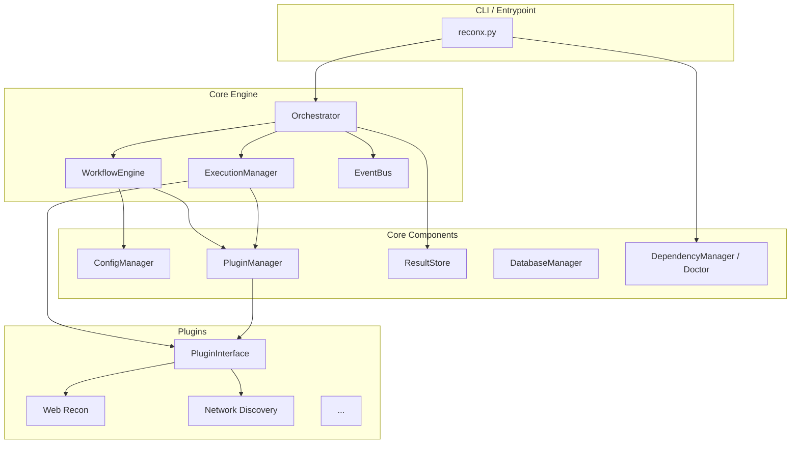

# STAGE 1 COMPLETION REPORT
**ReconX Core Platform Stabilization**

## 1. Executive Summary
Stage 1 of the ReconX V2.0.0 Refactor has been successfully completed. The primary objective of this stage was to establish a highly stable, predictable, and robust core platform before attempting to integrate complex external reconnaissance tools. The core architecture has been thoroughly restructured, dependencies have been fortified, and a robust plugin foundation is now in place.

## 2. Core Architecture Diagram

## 3. API Surface Summary

The ReconX platform now exposes well-defined APIs for developers and plugins:

- **`PluginManager`**: Exposes `load(plugin_name)` to easily resolve and instantiate plugins dynamically.
- **`WorkflowEngine`**: Standardizes the execution of YAML definitions via `load_workflow` and `execute`.
- **`EventBus`**: Centralized async pub/sub model using `subscribe`, `publish`, and `unsubscribe`.
- **`ConfigManager`**: A unified Singleton configuration manager allowing dot-notation access (e.g., `config.get('general.threads')`), environment variable overrides, and dynamic runtime updates.
- **`ResultStore` & `DatabaseManager`**: Standardizes SQLite operations through SQLAlchemy with automatic fallback to JSON flat-files for legacy compatibility.

## 4. Plugin Contract Definition

All plugins within the ReconX ecosystem must now adhere to the unified `PluginInterface`. 

**Required Properties:**
- `name`: str
- `version`: str
- `description`: str

**Required Methods:**
- `run(config: dict, context: dict) -> dict`: The primary execution entrypoint for all new plugins.
- `execute(config: dict, context: dict) -> dict`: Supported purely for backward compatibility with legacy plugins.
- `validate() -> bool`: Method to perform pre-flight checks (e.g., verifying `nmap` is installed before execution).

## 5. Standardized Reporting Schemas
Defined in `core/schemas.py`, the core now heavily relies on strict Pydantic schemas for data integrity:
- `Finding`
- `Asset`
- `Host`
- `Evidence`
- `Severity` (Enum)

## 6. Pending Technical Debt (For Stage 2)

While Stage 1 stabilized the core, Stage 2 (Tool Integration & Validation) must address the following:
1. **Dependency Resolution**: Several core dependencies are currently missing from the user's environment (`aiohttp`, `fastapi`, `sqlalchemy`, etc.). Stage 2 should enforce a strict `requirements.txt` installation sequence.
2. **Missing Golden Plugins**: `Doctor` revealed that multiple "Golden" plugins (e.g., `dns_intelligence`, `network_discovery`) are physically missing or improperly named within the `plugins/golden/` directory. These must be restored or rewritten.
3. **Database Schema Evolution**: Existing SQLite schemas are partially unaligned with the new Pydantic models. Alembic or a similar migration tool should be introduced.
4. **Asynchronous Command Execution**: `subprocess_runner.py` relies on `asyncio.create_subprocess_exec` but could benefit from robust process management (zombie process reaping) during long-running tasks like `masscan`.
