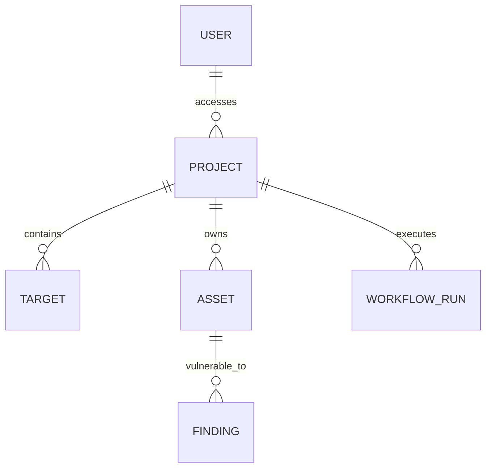

# Database Architecture

ReconX uses **PostgreSQL 15+** via the **SQLAlchemy 2.0 Asyncio** driver (`asyncpg`).

## Core Principles
1. **Async Only**: No blocking `Session` calls. Everything uses `AsyncSession`.
2. **Repository Pattern**: No raw SQL or SQLAlchemy ORM queries in the API routes. All access must go through repository classes (e.g., `user_repo`, `project_repo`).
3. **Migrations**: All schema changes must be represented by an Alembic migration.

## ERD Overview

