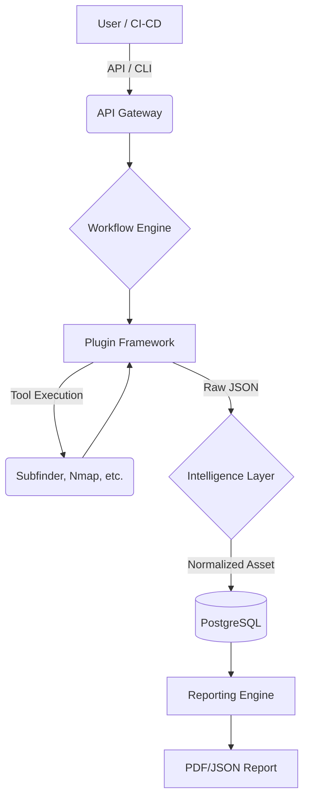

# System Overview

ReconX is designed as a centralized orchestration platform for offensive security tooling.

## High-Level Architecture

The platform operates using the following flow:

### Components

1. **API / CLI**: The primary interfaces for interacting with the system. Built on FastAPI and Typer.
2. **Workflow Engine**: Parses YAML workflow definitions and executes tasks in a Directed Acyclic Graph (DAG), ensuring dependencies are met.
3. **Plugin Framework**: Abstracts away the specific CLI commands of underlying tools. Responsible for securely executing tools and capturing output.
4. **Intelligence Layer**: Receives raw output from tools. Normalizes it into a standard `Asset` or `Finding` schema, deduplicates, and correlates relationships (e.g. associating an IP with a Domain).
5. **Database**: PostgreSQL (via SQLAlchemy 2.0 Asyncio) stores the state of the world securely.
6. **Reporting**: Aggregates data from the database into actionable executive summaries.
