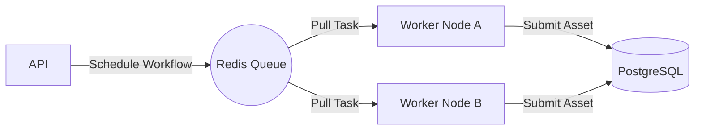

# ReconX v2.0 Architecture Roadmap

While v1.0 establishes a solid, monolithic orchestration platform, ReconX v2.0 will focus on transitioning to a distributed, enterprise-scale architecture.

## 1. Distributed Scanning Architecture
The most significant change in v2.0 will be the decoupling of the API from the Workflow Engine.

- **Controller Node**: The main API server, handling authentication, scheduling, and database writes.
- **Task Queue**: Introduction of Redis or RabbitMQ. The Controller pushes tasks (e.g., `execute_plugin('subfinder', 'example.com')`) to the queue.
- **Worker Nodes**: Lightweight, horizontally scalable instances that pull tasks from the queue, execute the subprocess, and return the normalized JSON to a result queue.

## 2. Remote Agents
Instead of running plugins locally, v2.0 will support Remote Agents. These agents can be deployed in Cloud VMs, VPSs, or Kubernetes clusters across different geographical regions to bypass geo-blocking or rate limiting.

## 3. Cloud Recon Architecture
v2.0 will expand beyond traditional network and web reconnaissance.
New plugin categories will include:
- `cloud_enumeration` (AWS/GCP/Azure)
- `container_discovery` (Kubernetes/Docker)
- `identity_analysis` (IAM Audits)

## 4. Database Evolution
To support 10M+ assets and 100M+ findings:
- Implementation of PostgreSQL Partitioning by `project_id`.
- Read Replicas for reporting offload.
- Archival storage strategies for historic scans.

## 5. AI-Assisted Analysis (Research)
Exploration of LLM integration (e.g., via OpenAI/Anthropic APIs) to:
- Summarize complex finding chains.
- Prioritize risk contextually.
- Suggest follow-up workflows based on initial discovery.
*Note: AI will never be authorized to automatically exploit targets.*
