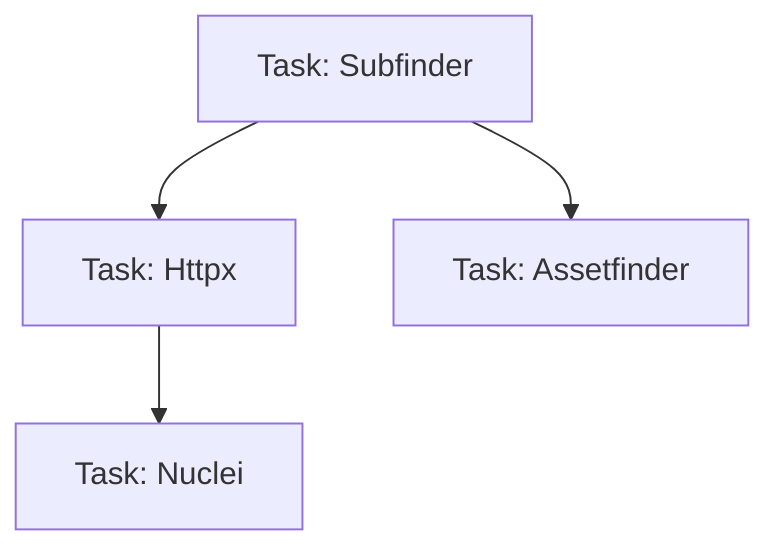

# Workflow Engine

The Workflow Engine is responsible for translating user intent (a workflow YAML) into a series of plugin executions.

## Execution Model

Workflows in ReconX are defined as a Directed Acyclic Graph (DAG) of Tasks.

The engine:
1. Validates the DAG for cycles.
2. Identifies tasks with no dependencies and schedules them immediately.
3. Subscribes to an internal Event Bus. As tasks complete, the engine recalculates the ready queue and dispatches downstream tasks.

## State Management
Task states (`PENDING`, `RUNNING`, `COMPLETED`, `FAILED`) are persisted to the database to survive engine restarts and allow for resuming broken pipelines.
